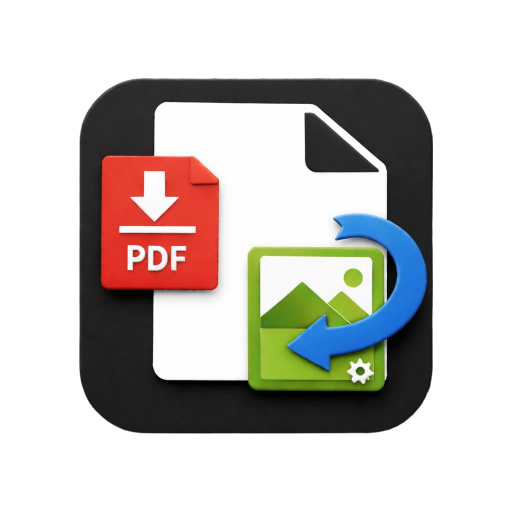
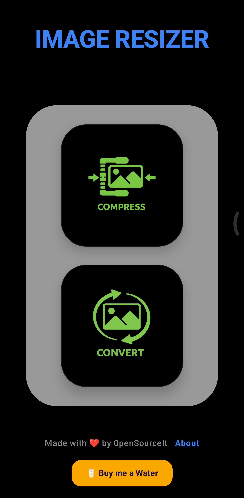
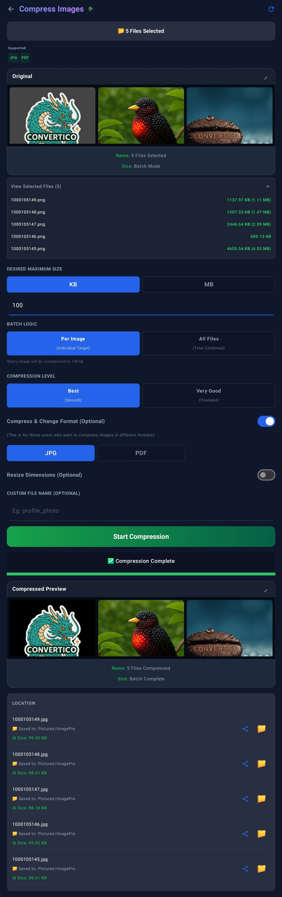
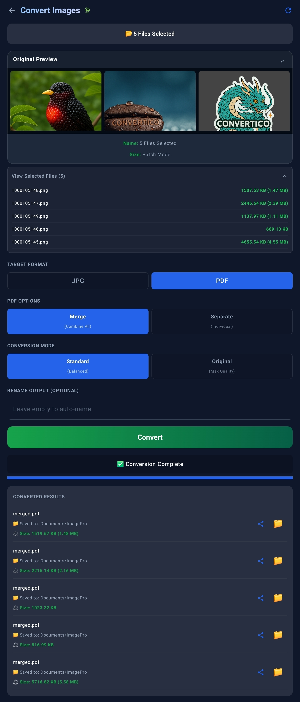
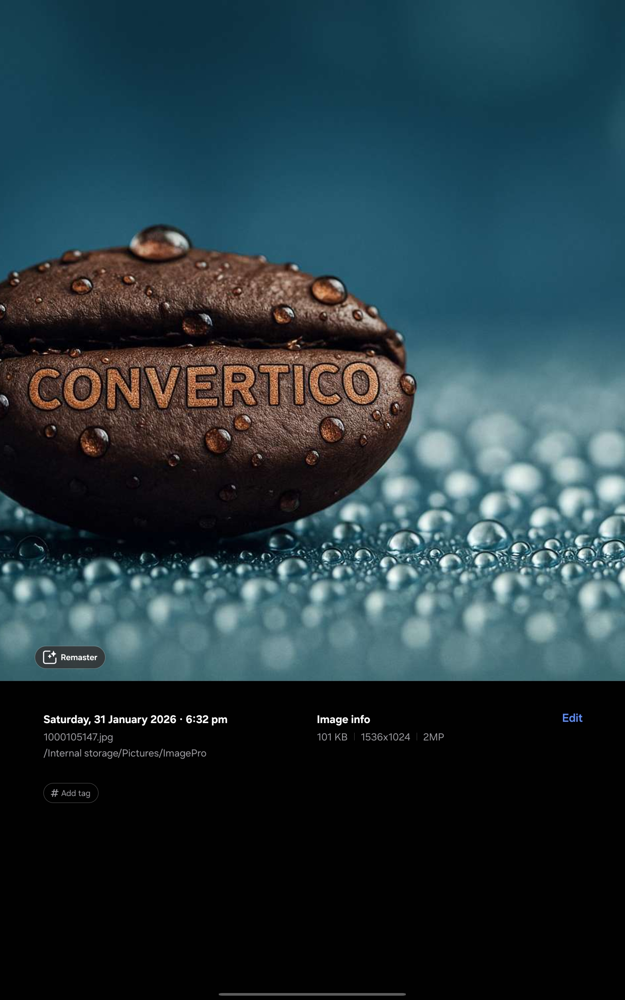
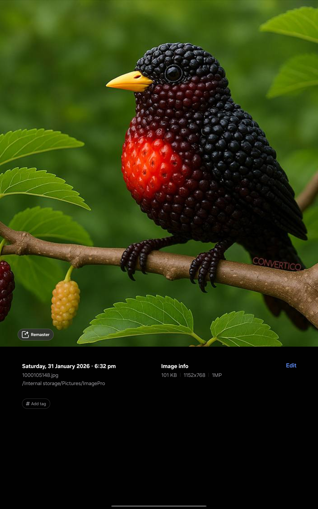

  
  <h1>Image ReSizer Lite</h1>

  
  
  
  
  

**Image ReSizer Lite** is a lightweight, powerful, and privacy-focused Android application designed to help you manage your images efficiently. This is the **Lite version** of the original Image ReSizer, optimized for speed and essential features.

---

## 🤖 Behind the Development

This project embraces the future of software creation:
- **Core Execution:** Developed using **Gemini Pro AI** within **Android Studio**, allowing for rapid development and optimized implementation.
- **Creative Direction:** The **UI/UX Design, Feature Logic, and App Architecture** were conceptualized and directed by **0penSourceIt**.

---

## 📸 Screenshots

  <table>
    <tr>
      <td align="center"><b>Home Screen</b></td>
      <td align="center"><b>Compress Screen</b></td>
      <td align="center"><b>Convert Screen</b></td>
    </tr>
    <tr>
      <td></td>
      <td></td>
      <td></td>
    </tr>
    <tr>
      <td align="center" colspan="1.5"><b>Sample 01 (Compressed)</b></td>
      <td align="center" colspan="1.5"><b>Sample 02 (Converted)</b></td>
    </tr>
    <tr>
      <td align="center" colspan="1.5"></td>
      <td align="center" colspan="1.5"></td>
    </tr>
  </table>

---

## How it Works: 

### Compression Page:
- You can select Single image or multiple (Batch Images).
- You can input Desire Size either in KB or MB. 
- Can compress into either JPG/JPEG or PDF (whichever you select).
- There are certain modes you can consider.
- Select the format JPG/PDF?
- Compress and your output with location will be displayed into Preview-Card
- Same Goes for **Conversion Page**

## 🛠️ Key Features (Lite Edition)

### ⚡ Smart Compression Engine
- **Binary Search Quality:** Finds the optimal quality percentage to hit your specific target size.
- **Privacy First:** All processing happens locally on your device. No images are uploaded to any server.
- **Iterative Scaling:** Automatically adjusts dimensions to ensure target sizes are met without crashing.

## 📜 License & Motive

### Main Motive: **For The People** ❤️
The primary goal of this project is to provide a free, high-quality, and lightweight tool for the community.

### Licensing
This project is licensed under the **Creative Commons Attribution-NonCommercial 4.0 International (CC BY-NC 4.0)**.

**Made with ❤️ for the community.**
